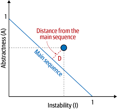

### 추상도, 불안정도, 메인 시퀀스로부터의 거리

추상도, 불안정도, 메인 시퀀스로부터의 거리는 전부 컴포넌트 커플링에서 파생된 메트릭들.

- Robert Martin이 저술한 C++ 책에서 처음 사용했지만 다른 객체지향 언어에도 적용 가능.

해당 메트릭을 측정하는 도구는 웬만한 플랫폼에서 지원됨. 생소함(unfamiliarity), 마이그레이션, 기술 부채 평가 등의 사유로 아키텍트가 코드베이스를 분석할 때 도움이 됨.

#### 추상도(abstractness)

추상도: 추상 아티팩트(추상 클래스, 인터페이스 등; abstract artifact)와 구상 아티팩트(구현체; concrete artifact)의 비율. 즉, 구현 대비 추상화 정도.

`모듈의 추상도(A) = 추상 요소의 합 / 구상 요소의 합`

- 아키텍트는 추상 아티팩트와 구상 아티팩트의 구체적인 총 개수로 추상도를 계산함.

#### 불안정도(instability)

불안정도: 코드의 변동성(volatility). 불안정도가 높은 코드베이스는 변경시 커플링이 높아 더 깨지기 쉬움.

`모듈의 불안정도(I) = 원심 커플링 / (원심 커플링 + 구심 커플링)` == `outcoming / (outcoming + incoming)`

- 외부에서 호출되는 메서드를 많이 제공하는 클래스는 그 호출되는 메서드를 수정했을 때 호출하는 클라이언트 코드 역시 잘못될 확률이 높음. 그러므로 outcoming 요소가 높은 쪽이 불안정한 코드.

---

### 메인 시퀀스로부터의 거리(distance from the main sequence)

`D = |A + I - 1|`

- D: 메인 시퀀스로부터의 거리
- A: 추상도
- I: 불안정도
- 아키텍처 구조를 평가하는 전체적인 메트릭. 추상도와 불안정도와 마찬가지로 0~1 사이의 값을 지님.

메인 시퀀스는 **추상도와 불안정도 사이의 이상적인 관계**. 서로 경쟁적인 두 메트릭의 건전한 조합. 너무 추상적이지도 않고, 너무 불안정하지도 않은 적정 수준.

메인 시퀀스로부터의 거리는 특정 클래스를 대상으로 측정한 메인 시퀀스로부터의 수직 거리. 이 이상적인 선으로부터 얼마나 떨어져있는가! 선에 가까울수록 클래스 균형이 잘 맞는 것!

이 선으로부터 너무 떨어진 구역은 클래스 균형이 맞지 않는 것.

- 쓸모없는 구역(zone of uselessness): 오른쪽/바깥쪽. 추상도가 높고 안정적인 구조. 과한 추상화로 인해 오히려 사용하기 어려운 코드.
- 고통스런 구역(zone of pain): 왼쪽/안쪽. 추상화가 안되어 불안정한 구조. 추상화를 거의 안하고 구현 코드만 잔뜩 넣어 취약하고 관리하기 힘든 코드.

#### 메트릭의 한계

코드베이스를 뜯어볼 수 있게 도와주는 코드 레벨의 메트릭은 사실 다른 분석 도구들에 비해 많이 부족함.

코드 구조와 직접적으로 연관된 메트릭조차 해석이 필요하기 때문.

코드 레벨의 메트릭은 사실상 거의 다 주관적.

코드베이스의 복잡도 측정을 위한 메트릭인 순환 복잡도(cyclomatic complexity)의 경우 근본적 복잡도와 우발적 복잡도 구분 불가.

- 근본적 복잡도(essential complexity): 하부 문제가 복잡해서 생기는 복잡도.
- 우발적 복잡도(accidental complexity): 코드가 쓸데없이 복ㅈ바해서 생기는 우발적 복잡도.
