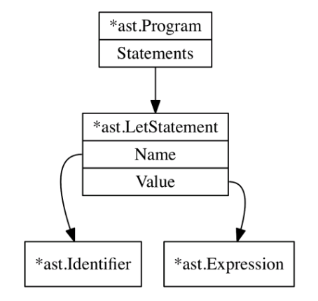

## 파서의 첫 단계: Let문 파싱

### 표현식 vs 명령문

- 명령문(statement): `let x = 5`, `return 5;`

  - 값을 만들지 않음

- 표현식(expression): `5`, `add(5, 5)`

  - 값을 만듬

다만, 프로그래밍 언어에 따라 표현식과 명령문의 범주는 달라질 수 있음. 함수 리터럴을 표현식으로 보는 언어와, 함수 선언문으로 보는 언어도 존재.

### 1) 표현식 노드 & 명령문 노드

AST에는 표현식 타입의 노드와 명령문 타입의 노드가 필요.

```go
package ast

// The base Node interface
// AST를 구성하는 모든 노드는 Node 인터페이스의 구현체
type Node interface {
	TokenLiteral() string // 토큰에 대응하는 리터럴값 반환(디버깅/테스트용)
	String() string
}

// All statement nodes implement this
type Statement interface {
	Node
	statementNode() // 더미 메서드. 컴파일 과정에서 검증 위함.
}

// All expression nodes implement this
type Expression interface {
	Node
	expressionNode()
}
```

### 2) Program 노드

파서가 생산하는 모든 AST의 루트 노드

```go
// Program 노드는 AST의 루트 노드. 프로그램을 구성하는 명령문 노드들의 슬라이스
type Program struct {
	Statements []Statement
}

func (p *Program) TokenLiteral() string {
	if len(p.Statements) > 0 {
		return p.Statements[0].TokenLiteral()
	} else {
		return ""
	}
}

func (p *Program) String() string {
	var out bytes.Buffer

	for _, s := range p.Statements {
		out.WriteString(s.String())
	}

	return out.String()
}
```

### 변수 바인딩(variable binding)

- let문의 파싱이란 let문이 담고 있는 정보를 정확히 표현하는 AST를 만들어내는 것
- `let <identifier> = <expression>` 형식의 명령문

```c
// 식별자: x, y, add
// 표현식: 10, 15, 함수 리터럴

let x = 5; // x라는 이름에 5라는 값을 바인딩
let y = 10;
let add = fn(a, b) {
    return a + b;
}
```

- Identifier & LetStatement 구현

```go
// 식별자 - 값을 생성하지는 않지만 개발 편의를 위해 표현식(Expression)으로 구현
type Identifier struct {
	Token token.Token // the token.IDENT token
	Value string
}

func (i *Identifier) expressionNode() {}
func (i *Identifier) TokenLiteral() string {
    return i.Token.Literal
}
func (i *Identifier) String() string {
    return i.Value
}
```

```go
// 변수 바인딩 - statement
type LetStatement struct {
	Token token.Token // the token.LET token
	Name  *Identifier // 바인딩될 변수의 <식별자>
	Value Expression // 값을 생성하는 <표현식>
}

// Statement 인터페이스의 메서드들 전부 구현
func (ls *LetStatement) statementNode() {}
func (ls *LetStatement) TokenLiteral() string {
    return ls.Token.Literal
}
func (ls *LetStatement) String() string {
	var out bytes.Buffer
	out.WriteString(ls.TokenLiteral() + " ")
	out.WriteString(ls.Name.String())
	out.WriteString(" = ")
	if ls.Value != nil {
		out.WriteString(ls.Value.String())
	}
	out.WriteString(";")
	return out.String()
}
```


